# IF3210-2023-Android-GKA

## Deskripsi Singkat

Aplikasi Majika adalah aplikasi yang dikembangkan untuk memenuhi tugas besar mata kuliah IF3210 Pemrograman Berbasis Platform. Aplikasi ini dibuat untuk mensimulasikan sebuah aplikasi pemesanan makanan dan minuman dengan beberapa utilitas tambahan. Aplikasi ini dibuat dengan menggunakan Android Studio dan bahasa pemrograman Kotlin.

Berikut adalah fitur yang ada pada aplikasi Majika:

- Header dan Navbar
- Daftar makanan dan minuman
- Keranjang
- Pembayaran
- Pencarian cabang restoran dengan GMaps
- Twibbon

Aplikasi ini juga menerapkan beberapa konsep dari pengembangan aplikasi di Android yaitu:

- Fetch API from Backend dengan Retrofit
- RecyclerView
- Integrasi Room Database dengan Repository Pattern
- Responsive Layout
- Fragments and Activities
- GMaps Intent
- Utilisasi sensor temperatur
- .. dan lain lain

## Library yang digunakan

Pada proses pengerjaannya, kami menggunakan beberapa library yang dapat membantu dalam proses pengembangan aplikasi. Berikut adalah library yang digunakan:

- Retrofit
- ZXing Scanner
- Room Database
- Camera2 API
- RecyclerView
- Coroutines
- dan tentunya, Android Core Library.

## Screenshot aplikasi

### Splash screen

  

### Menu makanan

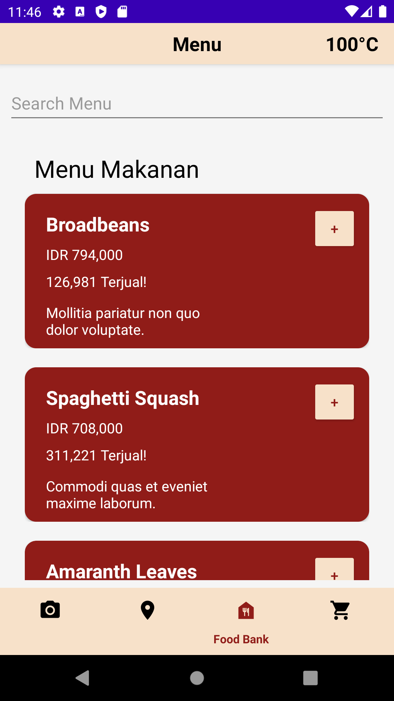  

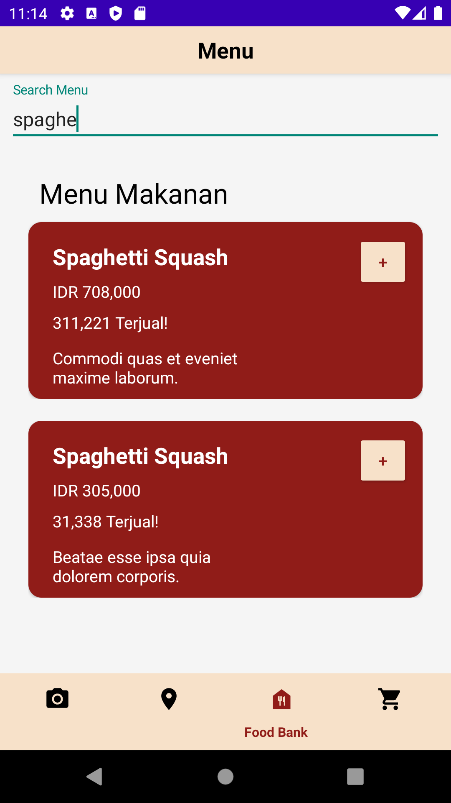

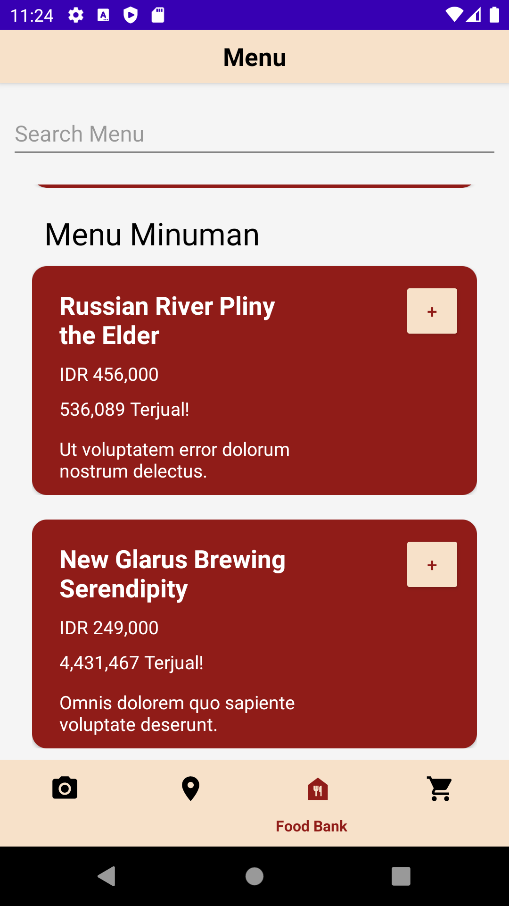 

### Cabang restoran

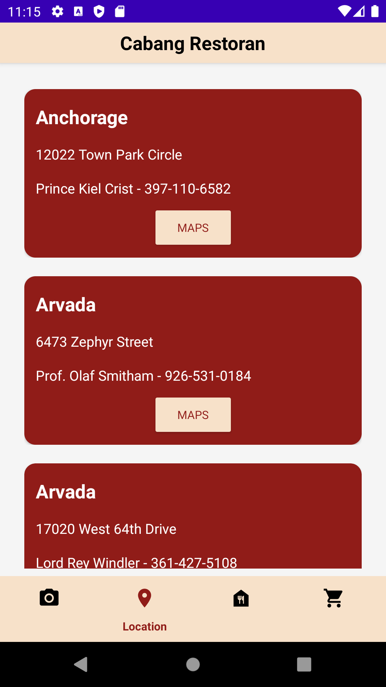

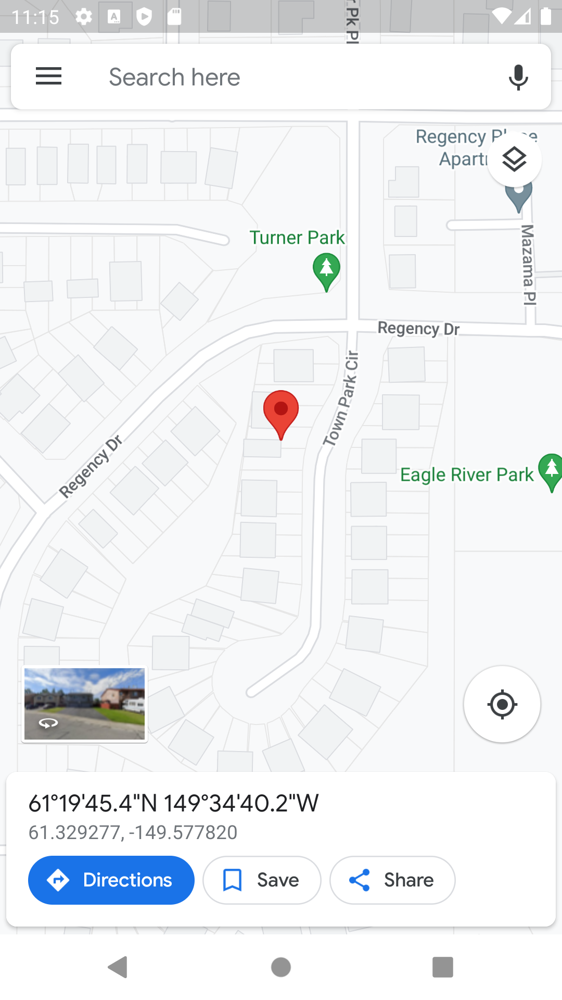

### Keranjang

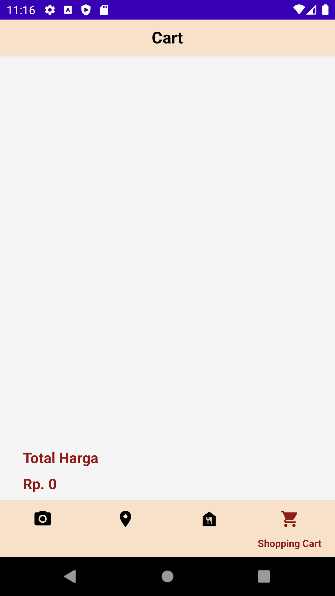

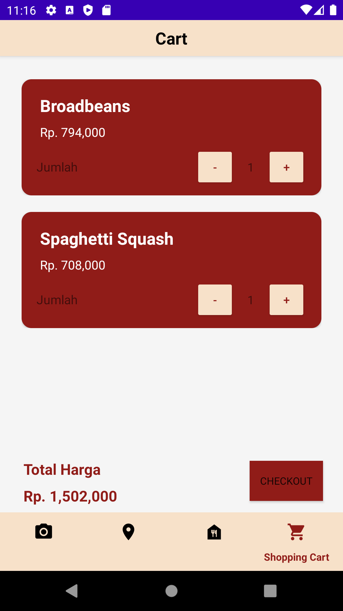

### Pembayaran

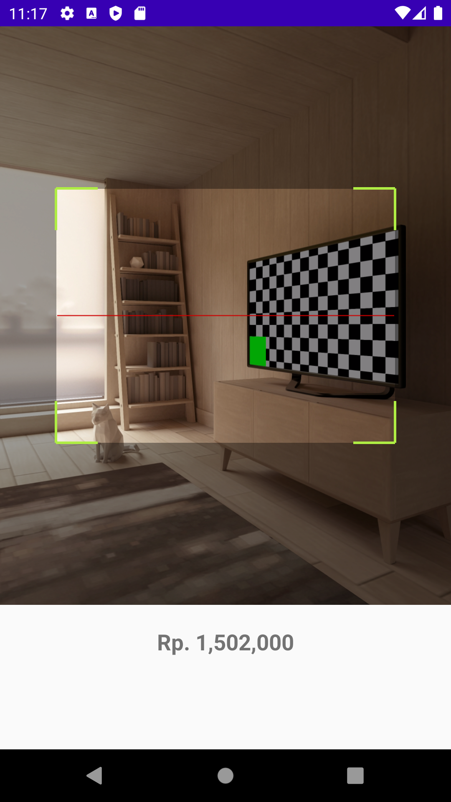

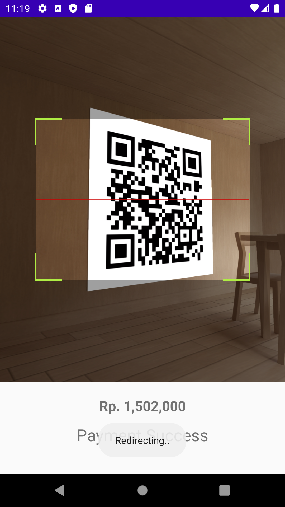

### Twibbon

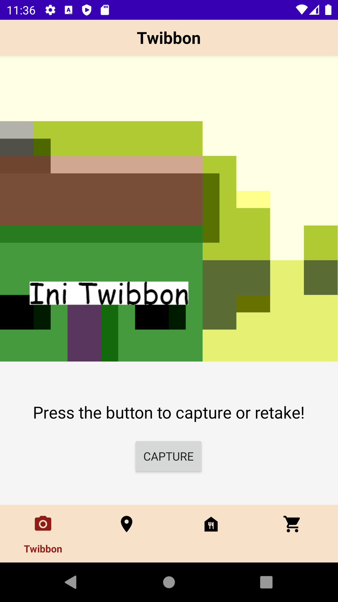  

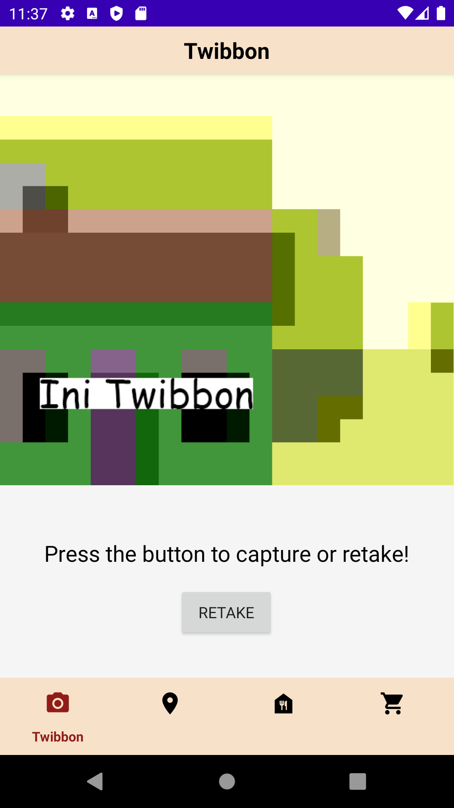  

## Pembagian kerja anggota kelompok

- 13520016 - Gagas Praharsa Bahar - Twibbon, pembayaran, splash screen
- 13520065 - Rayhan Kinan Muhannad - Pembayaran, responsive and search, fixing keranjang
- 13520101 - Aira Thalca Avila Putra - Navbar, Daftar makanan dan minuman, keranjang, dan cabang restoran

## Jumlah jam persiapan dan pengerjaan